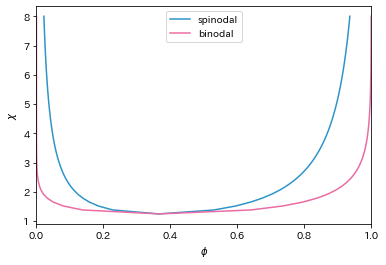

# Binodal Curve Calculation and Plotting

This Python program calculates and plots the binodal and spinodal curves of a polymer solution using the Flory-Huggins theory of polymer solutions.



## Features

- Calculation of the Flory-Huggins free energy
- Calculation of the spinodal points
- Calculation of the binodal curve
- Plotting of the phase diagram

## Usage

To run the program, simply open binodal.ipynb file on your Jupyter notebook and run.

The program will calculate and plot the phase diagram of the polymer solution.

## Requirements

This program requires the following Python libraries:

- numpy
- matplotlib

You can install these libraries using pip:

```bash
pip install numpy matplotlib
```

## Contributing

Contributions are welcome! Please feel free to submit a Pull Request.
